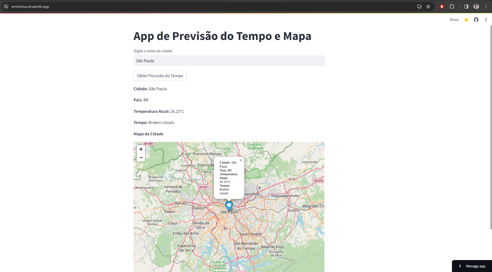
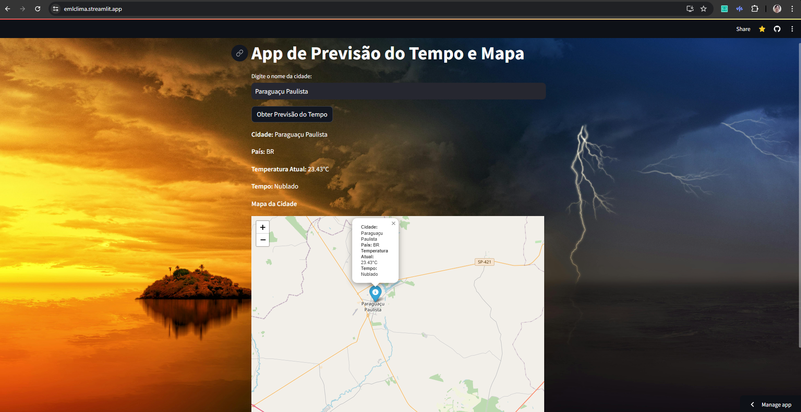

Available in web: emlclima.streamlit.app 🌎👨‍💻

Deploy successfully on streamlit. App entirely developed in Python using Streamlit e Folium. The user enters the name of any city and clicks the button to see the city's weather forecast and the map of the city where the weather was searched.

App atualizado com imagem de background da Internet:

